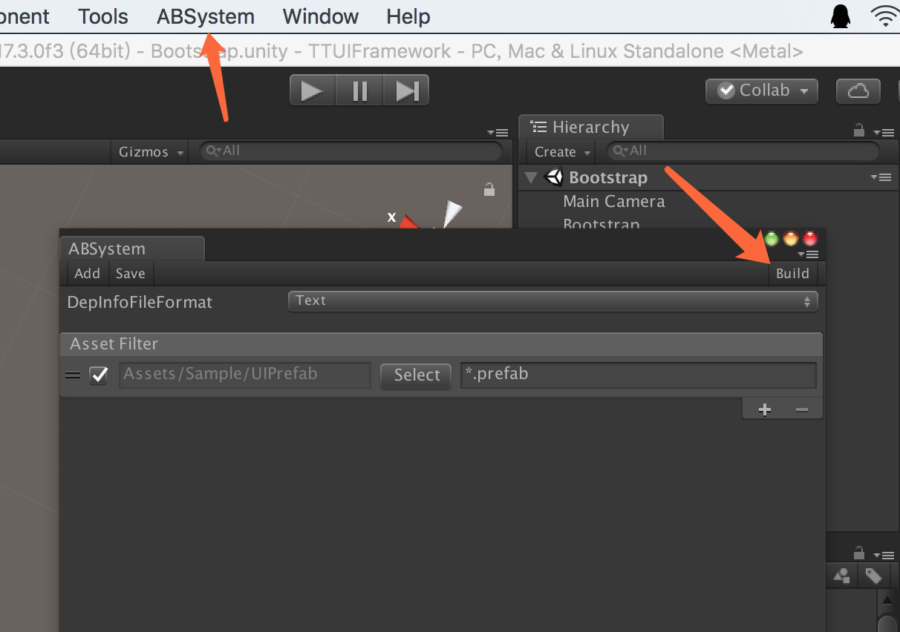

# TTUIFramework
原版说明在 https://github.com/chiuan/TTUIFramework/blob/master/README.md

在 TTUIFramework 基础上精简了代码，加入 [ABSystem](https://github.com/tangzx/ABSystem) 和 [CatLib](http://catlib.io/)。只是一个简单的集成，用于验证可能性。

首次使用时需要自己生成 AssetBundle，见图

